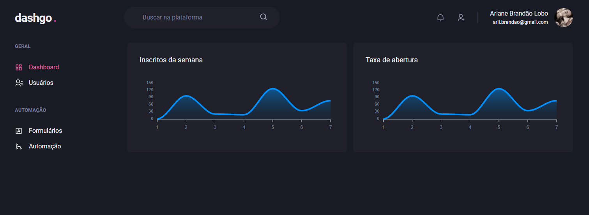

  

## dashgo
Um painel administrativo contendo fluxo de autenticação, dashboard, listagem e cadastrado de usuários. É mais um projeto desenvolvido durante minha jornada no [Ignite](https://www.rocketseat.com.br/ignite), da Rocketseat.

## Tecnologias

Esse projeto foi desenvolvido com as seguintes tecnologias:

- [NextJS](https://nextjs.org)
- [TypeScript](https://www.typescriptlang.org/)
- [Chakra UI](https://chakra-ui.com/)
- [React Hook Form](https://react-hook-form.com/)
- [APEXCHARTS.JS](https://apexcharts.com/)
- [Yup](https://github.com/jquense/yup)

## Como executar

- Clone o repositório
- Instale as dependências com `yarn`
- Inicie o servidor com `yarn dev`

Agora você pode acessar [`localhost:3000`](http://localhost:3000) do seu navegador.

## Licença

Esse projeto está sob a licença MIT. Veja o arquivo [LICENSE](LICENSE.md) para mais detalhes.
